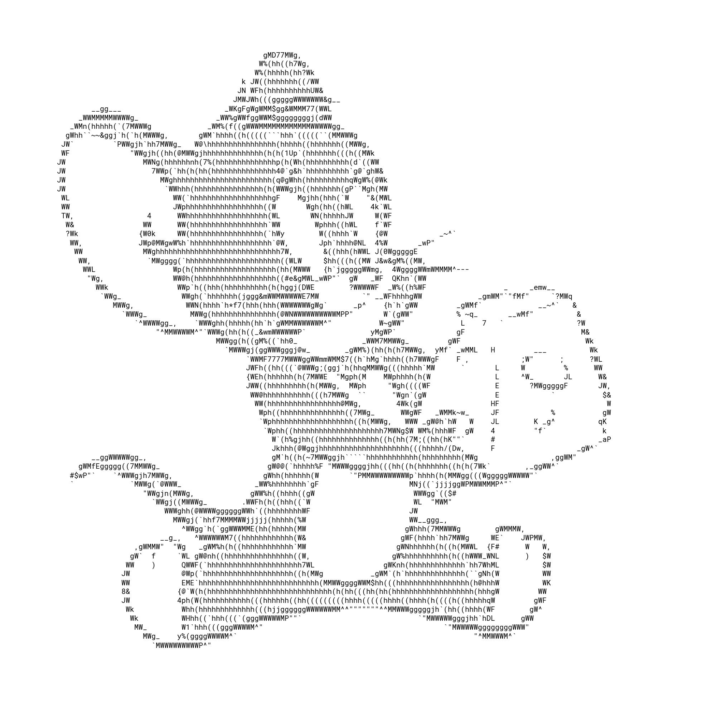
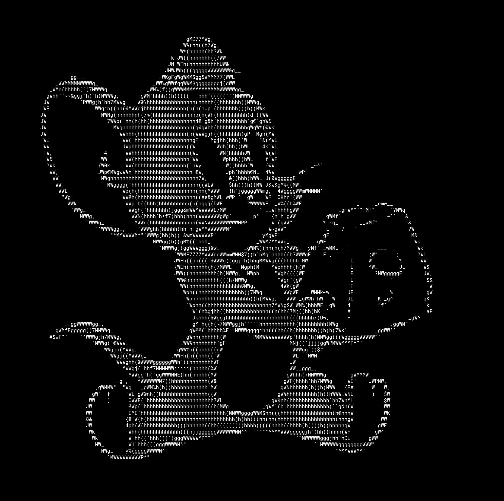

ASCII Art

Программа для преобразования изображения в ASCII Art

Программа работает через консоль, имеет несколько входных параметров:

Обязательные:
	-i, --input  : исходный файл изображения
	-o, --output : результат работы программы, в виде изображения

Необязательные:
	-x, --width  : ширина преобразованного изображения
	-y, --height : высота преобразованного изображения
	-b, --background: цвет фона ("black" или "white")
	-c, --contrast: уровень контрастности (до 255)

Примеры ввода:
	asciiart.py -i in.jpg -o out.jpg -x 1500 -y 1500 -b white -c 200
	asciiart.py --input in.jpg --output out.jpg --width 1500 --height 1500 --background black --contrast 150

Программа получается на вход изображение, результатом работы являются файл изображение с результатом и файл last_ascii.txt, в котором находится преобразованное изображение в текстовом формате.

В файле asciiart.py содержатся модули: CharDictionary, ImageConverter, ParserArguments, VerifierArguments

CharDictionary:
	Составляет словарь, в котором каждому символу сопоставляется jpg изображение этого символа.

ImageConverter:
	1. Получает на вход изображение
	2. Изменяет параметры ширины и высоты относительно входных параметров
		По умолчанию: width = 1200, 
			      height = ratio * 1200, где ratio — отношение исходной высоты изображения к ширине
	3. Преобразует изображение в черно-белый формат
	4. Переводит изображение к ASCII Art, исходя из его похожести на символ

ParserArguments:
	Преобразует полученные из консоли параметры в переменные 
		input_file, output_file, width, height, background_color, contrast

VerifierArguments:
	Проверяет корректность введенного файла.
	
	
Примеры преобразованных изображений:            

 

